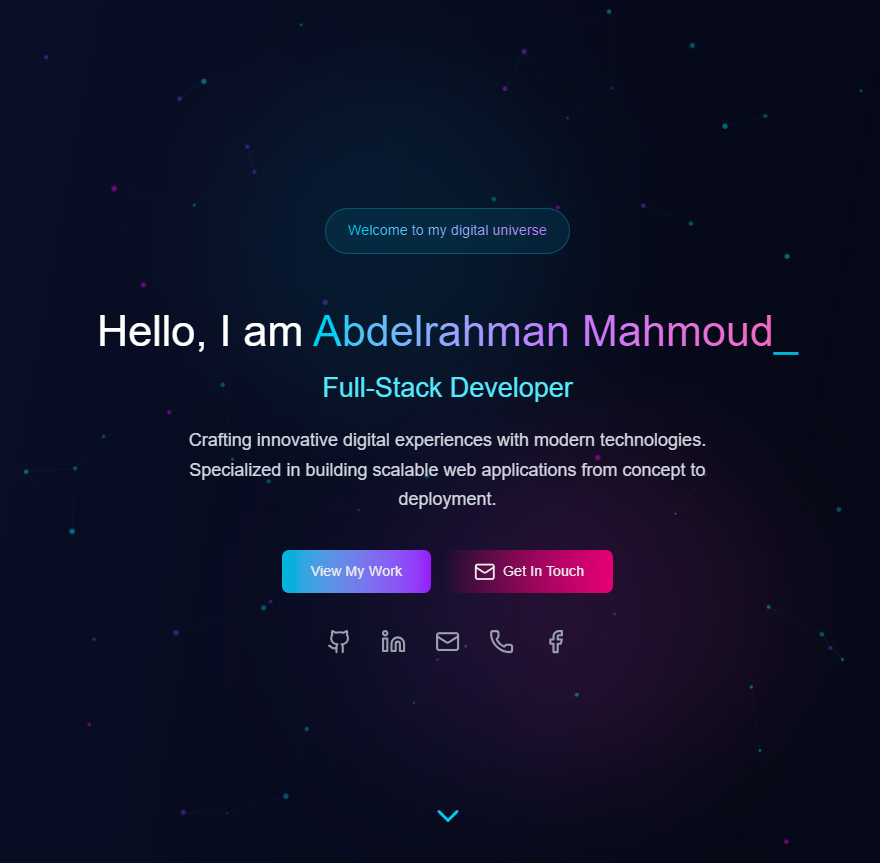
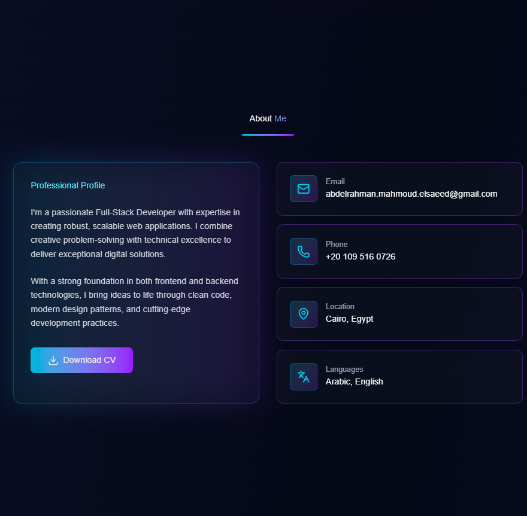
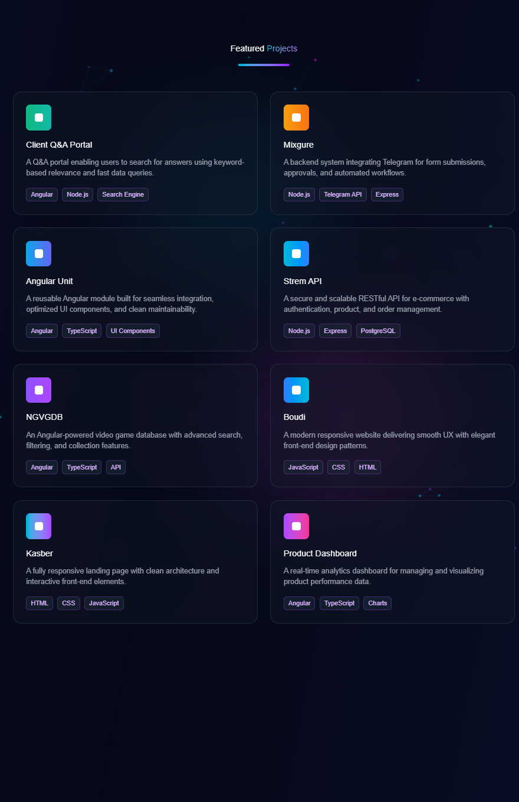
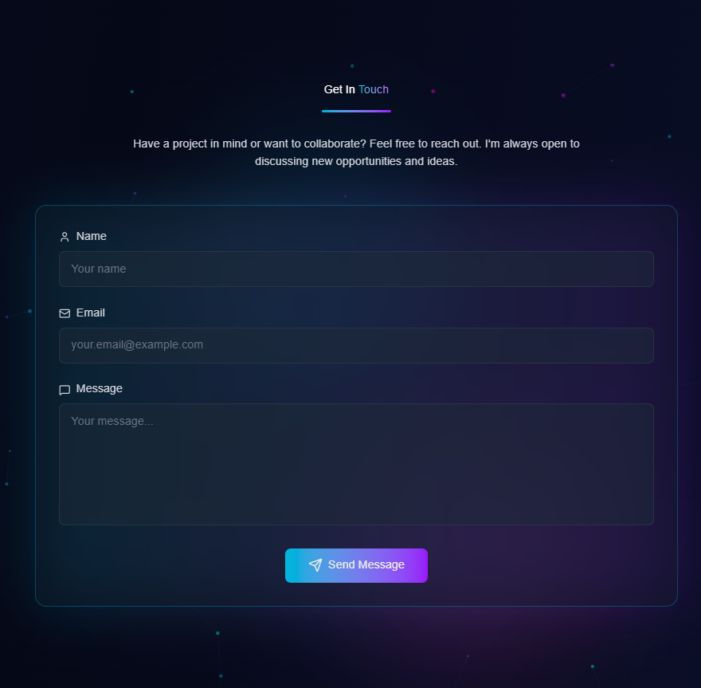

# Portfolio Website

A modern, SEO-friendly personal portfolio website built with **Next.js** and designed using **AI-assisted Figma workflows**.  
This project focuses on **clean design**, **high performance**, and **developer-friendly structure**.

---

## 🚀 Overview

This portfolio project was created to showcase my work as a **Full Stack Developer** while experimenting with new technologies outside my usual stack (Angular & ASP.NET).  
I chose **Next.js** for its SEO capabilities and server-side rendering, and used **AI-powered design tools** to create a more unique, visually appealing layout without needing advanced design experience.

---

## ✨ Key Features

- ⚡ **Next.js 14** — Server-side rendering for SEO and performance  
- 🎨 **AI-assisted Figma design** — Concept and UI generated with AI for creative layouts  
- 🧩 **Reusable components** — Structured and easy to extend  
- 📱 **Fully responsive** — Works across all devices  
- 🔍 **Optimized for SEO** — Meta tags, structured data, and fast loading  
- 🧠 **Built entirely with AI assistance** — From concept to deployment  

---

## 🛠️ Tech Stack

- **Frontend:** Next.js (React + TypeScript)
- **Design:** Figma + AI tools (Figma Make / Design AI)
- **Styling:** Tailwind CSS
- **Deployment:** Netlify
- **Version Control:** GitHub

---

## 🎯 Purpose

This project is part of my personal development journey — exploring how **AI can enhance web design and workflow efficiency**.  
I wanted to prove that even developers without strong design backgrounds can still build **modern, aesthetic, and SEO-optimized** portfolios with the right tools and mindset.

---

## 🧠 Lessons Learned

- How AI tools can speed up the design process  
- SEO considerations when building a personal website  
- Using Next.js for both static and dynamic rendering  
- Bridging creativity and functionality in full-stack projects  

---

## 📸 Screenshots

Here’s a quick look at the final UI:

  

  

  

  

---

## 🌐 Live Demo

🔗 [Visit Portfolio Website](https://abdelrahman-mahmoud.netlify.app/)

---

## 📫 Contact

If you’d like to connect or collaborate:  
**Email:** abdelrahman.mahmoud.elsaeed@gmail.com  
**GitHub:** [abdo6999](https://github.com/Abdelrahman-Mahmoud-Elsaeed)

---

### ⭐ If you find this project useful, please give it a star on GitHub!
